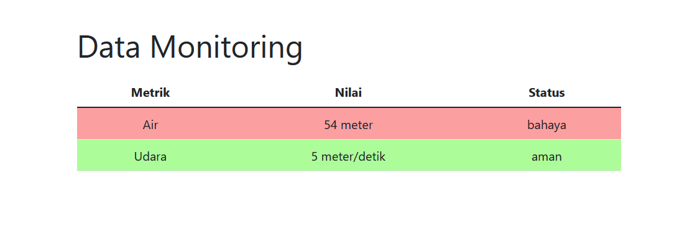

# Real-time Weather Monitoring System

This project provides a real-time weather monitoring system that displays the current water and wind conditions. 
It demonstrates the use of Go for backend development, Bootstrap for frontend styling, and dynamic data updates.

## Features

- Displays real-time water and wind conditions (based on random value).
- Updates data every 15 seconds without refreshing the page.
- Uses Bootstrap for a responsive and visually appealing user interface.
- Dynamically changes the background color of the table rows based on the status of water and wind conditions.
- Provides a command line interface (CLI) for monitoring status.
- Generates a monitor.json file with the latest weather conditions.

## Preview



## Usage

Install dependencies

```bash
go mod tidy
```

To run the program, use the following command:

```bash
go run main.go
```

### Access the dashboard
Open your web browser and go to `http://localhost:8080` to view the dashboard.

### Access the data endpoint
The data endpoint is available at `http://localhost:8080/data`. You can use this endponit to fetch the
latest weather data in JSON format.
